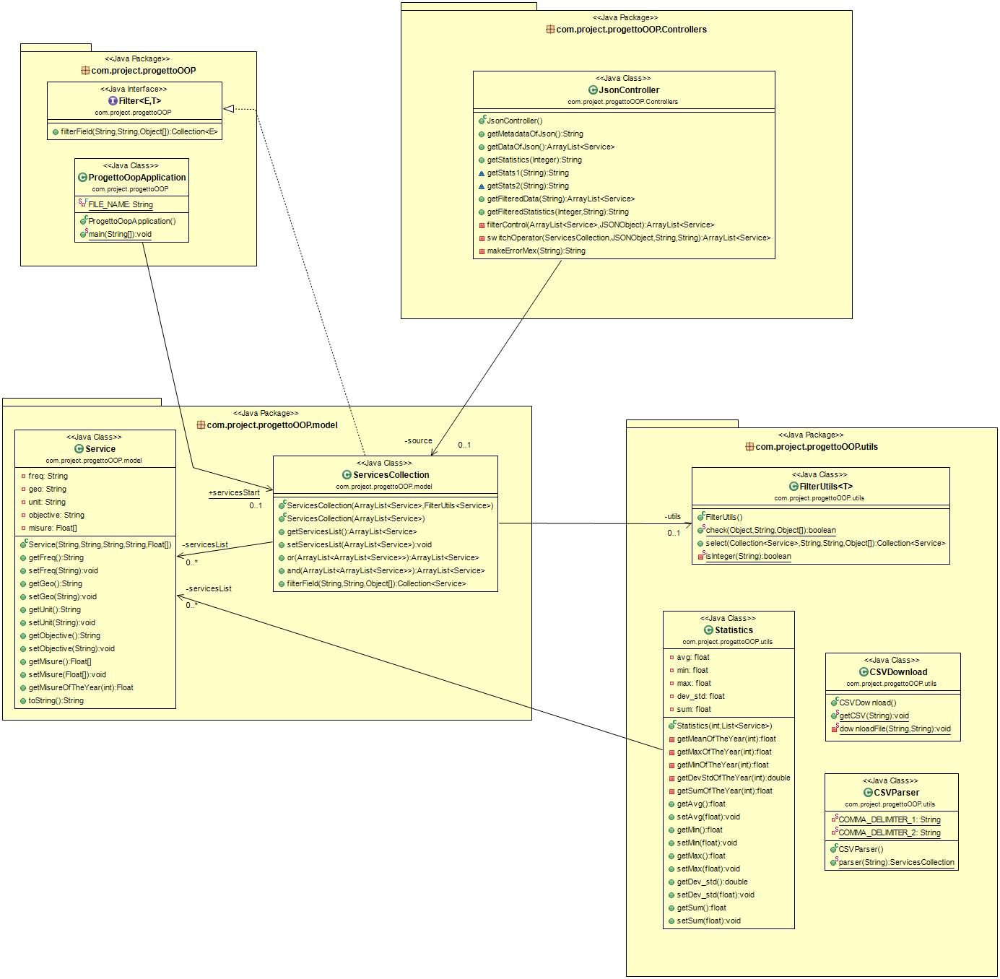
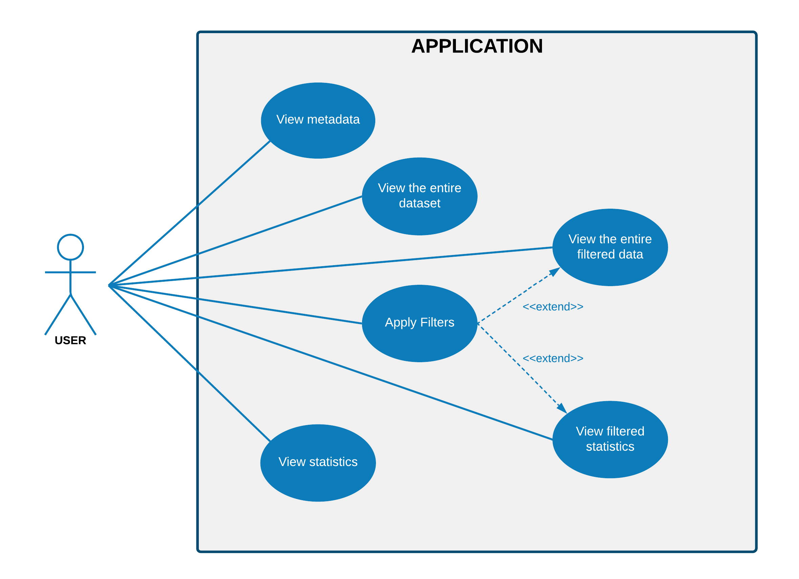
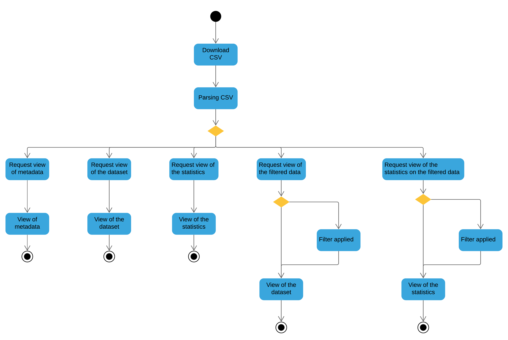
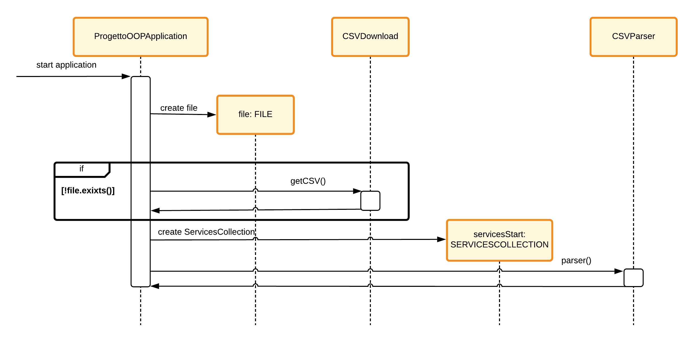
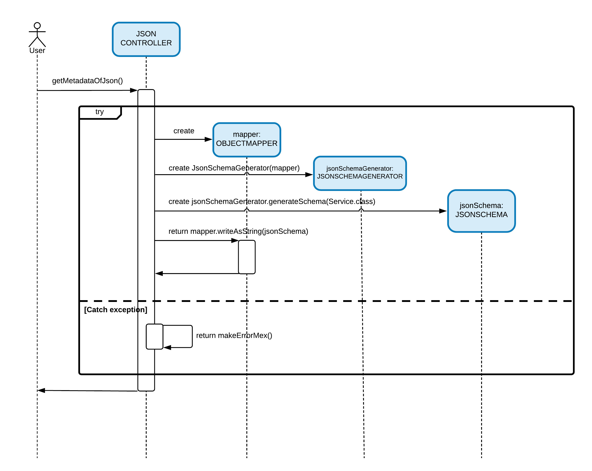
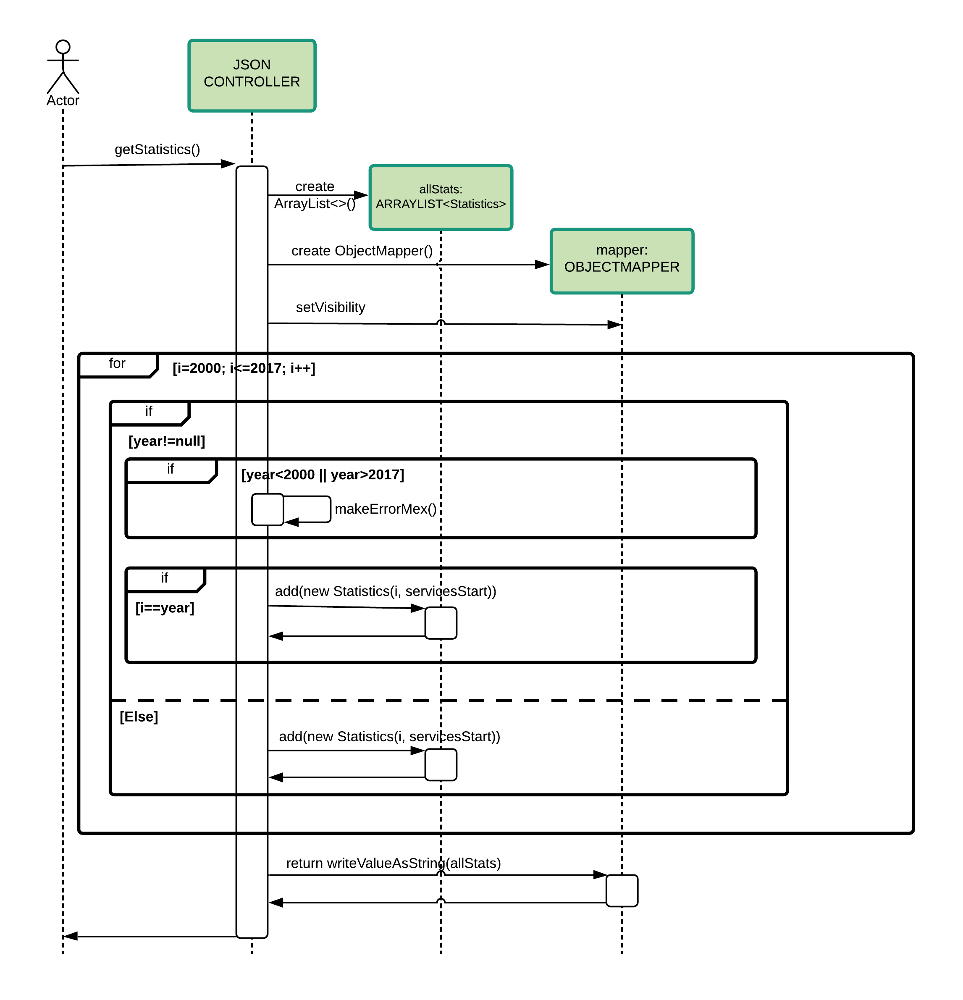
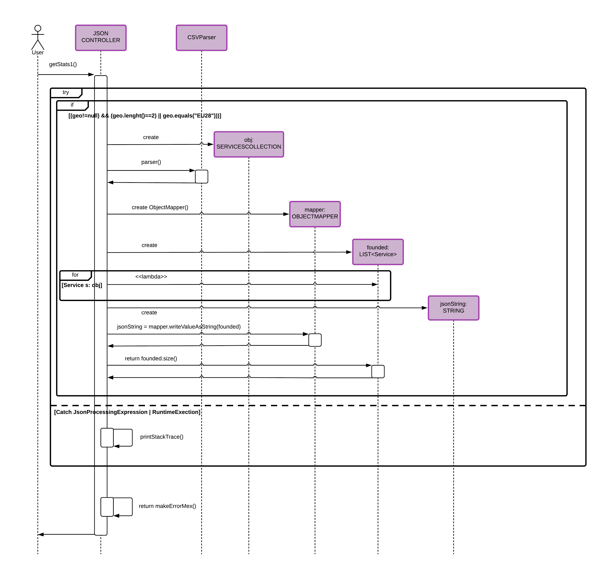
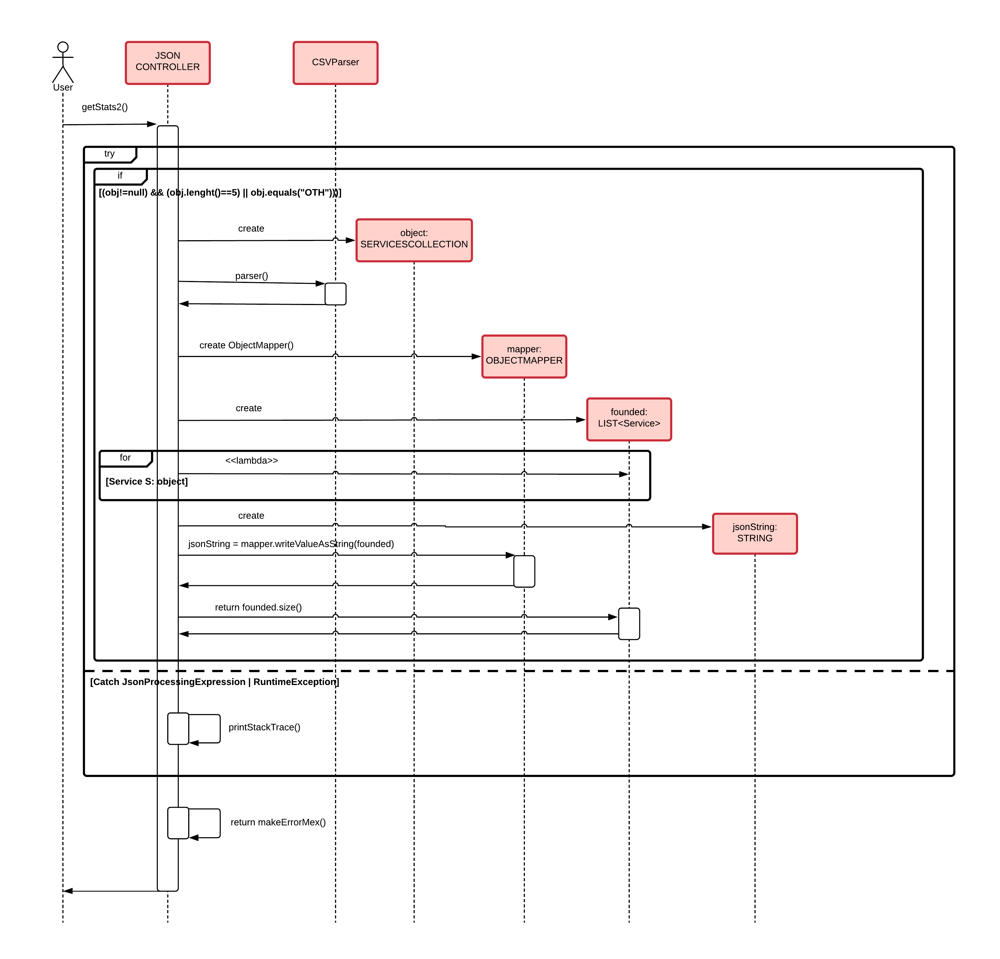

# PROGETTO OOP

L'applicazione permette di ottenere dati a partire da un dataset contenuto in un file CSV, dando poi la possibilità di filtrare gli stessi in base alle richieste dell'utente, e di calcolare statistiche sull'intera collezione di dati o su di una collezione parziale, contenente i dati già filtrati. 

## Panoramica sui dati
I dati rappresentano gli **investimenti (in percentuale di PIL) di un determinato stato dell'Unione Europea in un certo servizio, in una serie di anni (dal 2000 al 2017).** 
Il file è dunque una collezione di dati, ognuno dei quali tiene conto della frequenza (annuale) di campionamento (**freq**), della particolare entità geo-politica considerata - o dell'insieme dei Paesi dell'UE(**geo**) , dell'unità di misura dell'investimento, valutata in percentuale di PIL (**unit**), dell'obiettivo (**objective**) e della misura degli investimenti valutati per ogni anno (**misure**).

### METADATI
In base a quanto precedentemente specificato, è possibile notare come -in seguito ad una richiesta al servizio - venga restituito come risultato un JSON rappresentante un array di oggetti che raffigurano i dati appartenenti al nostro dataset. 
Il formato è in particolare il seguente:

### DATI
La collezione dei dati risulterà quindi formata nel seguente modo (per semplicità prendiamo soltanto una piccola parte dell'intera collezione di dati):

### STATISTICHE
Le statistiche numeriche - che vanno a valutare la somma degli investimenti (**sum**), l'investimento di valore massimo (**max**) o minimo (**min**), la media dei vari investimenti (**avg**) e la deviazione standard (**dev_std**) - vengono valutate sull'intero dataset o relativamente ad un singolo anno, a seconda che si scelga di specificare o meno nella richiesta un determinato anno. 
Abbiamo scelto di non implementare la statistica relativa al **count** perchè ci è sembrata priva di valenza logica nel nostro dataset.

Queste sono le statistiche calcolate prendendo in considerazione tutti gli anni dal 2000 al 2017, senza cioè passare alcun parametro indicante l'anno che si intende considerare.

Queste sono invece le statistiche calcolate prendendo in considerazione soltanto il 2017, passato come parametro nella richiesta. 

Per quanto riguarda invece le statistiche circa il **numero di occorrenze** di un determinato campo (nel nostro caso, abbiamo ritenuto opportuno calcolarle per il campo **"geo"** ed il campo **"objective"**), queste possono essere ottenute tramite richiesta GET, come possiamo vedere di seguito: 

Questo screen mostra il numero di occorrenze relativo a "IT", indicante ovviamente il paese Italia.

Mentre qui viene mostrato il numero di occorrenze relativo a "OBJ01".

## Path: GET & POST
Gli endpoint utilizzati per realizzare le varie richieste sono i seguenti:

> **GET/** 

Rotta in base alla quale le richieste vengono veicolate tramite query string, cioè la parte di un URL che contiene dei parametri da passare in input ad un’applicazione.

> **GET/metadata** 

Rotta con cui è possibile accedere ai metadati relativi al dataset.

> **GET/data** 

Rotta con cui è possibile accedere all'intera collezione di dati rappresentanti il dataset.

> **GET/statistics** 

Rotta con cui è possibile andare a calcolare le statistiche (numeriche) relative all'intero dataset. In particolare si possono distinguere due differenti casi:
- **Parametro (anno) presente**: le statistiche vengono valutate soltanto relativamente all'anno che si intende considerare.
- **Parametro (anno) assente**: le statistiche vengono valutate sull'intero dataset considerando ogni anno dal 2000 al 2017.

> **GET/statistics/geo/{geo}**

Rotta con cui è possibile andare a calcolare il numero di occorrenze della particolare entità geo-politica specificata nella richiesta stessa. 

> **GET/statistics/objective/{obj}** 

Rotta con cui è possibile andare a calcolare il numero di occorrenze del particolare obiettivo (ossia il servizio in cui si è scelto di investire) specificato nella richiesta stessa. 

> **POST/**

Rotta che consente di inviare dati ad un server senza mostrarli in query string, ma che richiede di utilizzare linguaggi di programmazione e/o tool esterni come Postman per effettuare le richieste.

> **POST/data/filtered**

Rotta con cui è possibile ottenere i dati, eventualmente filtrati. Si distinguono in particolare due differenti casi:
- **Corpo della richiesta presente (e contenente il filtro)**: si ottiene una collezione "parziale" di dati, ottenuta andando a filtrare l'intero dataset sulla base dei filtri specificati dall'utente.
-  **Corpo della richiesta non presente**: si ottiene l'intero dataset, sul quale non viene ovviamente applicato alcun filtro.

> **POST/statistics/filtered**

Rotta con cui è possibile ottenere le statistiche sui dati, eventualmente filtrati. Si distinguono in particolare quattro differenti casi:
- **Corpo della richiesta presente (e contenente il filtro) e parametro (anno) presente**: restituisce le statistiche calcolate sul dataset filtrato in base ai filtri richiesti dall'utente e relative al particolare anno specificato.
- **Corpo della richiesta presente (e contenente il filtro) e parametro (anno) assente**: restituisce le statistiche calcolate sul dataset filtrato in base ai filtri richiesti dall'utente, considerando ogni anno, dal 2000 al 2017.
- **Corpo della richiesta assente e parametro (anno) presente**: restituisce le statistiche calcolate sull'intero dataset e relative al particolare anno specificato.
- **Corpo della richiesta assente e parametro (anno) assente**: restituisce le statistiche calcolate sull'intero dataset, considerando ogni anno, dal 2000 al 2017.

## Filtri 
Nella richiesta POST può essere specificato un filtro, utile per poter selezionare soltanto particolari dati. Il filtro non è altro che una stringa in formato JSON, contenente degli oggetti aventi la seguente struttura:

 **1. CAMPO**: Il campo su cui viene applicato il filtro può essere uno qualsiasi dei campi già visti (**geo**, **freq** - anche se inutile, perchè sempre uguale ad "A", che sta per "ANNUALE" -, **unit** - anche qui inutile, dal momento che è sempre uguale a "PC_GDB", che sta per Percentuale di PIL -, **objective** e **year** - ossia l'anno (che va dal 2000 al 2017) del quale si vogliono considerare le misure dell'investimento, cioè l'ammontare dell'investimento in percentuale di PIL).
 
 **2. OPERATORE**: Tra gli operatori che abbiamo invece considerato ritroviamo: :
-   **$eq**:  indica se il valore del campo considerato è uguale a quello indicato nel filtro.
-   **$not** : indica se il valore del campo considerato è diverso da quello indicato nel filtro
-   **$in**:  specificato un insieme di valori, indica se il valore del campo considerato è equivalente ad uno di questi valori.
-   **$nin**:  specificato un insieme di valori, indica se il valore del campo considerato non è nessuno di questi valori.
-   **$lt:**  indica se il valore del campo considerato è più piccolo rispetto a quello indicato nel filtro.
-   **$lte:**  indica se il valore del campo considerato è più piccolo o uguale rispetto a quello indicato nel filtro.
-   **$gt:**  indica se il valore del campo considerato è più grande rispetto a quello indicato nel filtro.
-  **$gte:**  indica se il valore del campo considerato è più grande o uguale rispetto a quello indicato nel filtro.
-   **$bt:**  specificati due valori numerici, indica se il valore del campo considerato è compreso tra questi due valori.

 **3. DATO**: I dati possono essere stringhe, valori numerici o array contenente più valori dello stesso tipo (nel caso di $bt, $in, $nin) .

Attraverso gli operatori logici AND e OR è poi possibile unire più filtri tra loro: 
-   **$and**:  dati due o più filtri, permette di realizzare l'intersezione tra essi, cioè di prendere soltanto i valori in comune ai vari filtri.
-   **$or**:  dati due o più filtri, permette di realizzare l'unione tra essi, cioè di prendere tutti i valori, sia quelli in comune che quelli non in comune ai vari filtri, senza considerare i valori che si ripetono.

Di seguito, alcuni esempi di filtri:

Questo screen mostra il filtro in cui vengono presi soltanto i dati i cui campi "geo" sono uguali a "HU" o a "DK".

Questo screen mostra invece il filtro in cui vengono presi tutti i dati il cui campo"geo" non è uguale a "EU28" o a "FR", e questi vengono intersecati con i dati il cui campo "objective" risulta essere diverso da "OBJ02".

Questo screen mostra infine il filtro in cui vengono presi dapprima tutti i dati - il cui campo"geo" è uguale a "IT" - intersecati con quelli il cui campo "objective" risulta essere uguale da "OBJ01". Quindi vengono presi i dati il cui campo "geo" è uguale a "AT" o "FR" e uniti a quelli il cui campo "geo" è uguale a "BE". Infine i dati risultanti vengono uniti, e si avrà quindi una collezione di dati il cui campo "geo" sarà uguale a "AT", "BE", "FR" e "IT", ma quest'ultimo soltanto con il campo "objective" pari a "OBJ01".

## UML Diagrams

### CLASS DIAGRAM

### USE CASE DIAGRAM

### ACTIVITY DIAGRAM

### SEQUENCE DIAGRAM

Avvio dell'applicazione:

Funzione che va a richiedere i metadati:

Funzione che va a richiedere le statistiche sull'intero dataset, eventualmente specificando l'anno:

Funzione che va a richiedere le statistiche riguardanti il numero di occorrenze della particolare entità geo-politica di interesse:

Funzione che va a richiedere le statistiche riguardanti il numero di occorrenze del particolare obiettivo di interesse:

